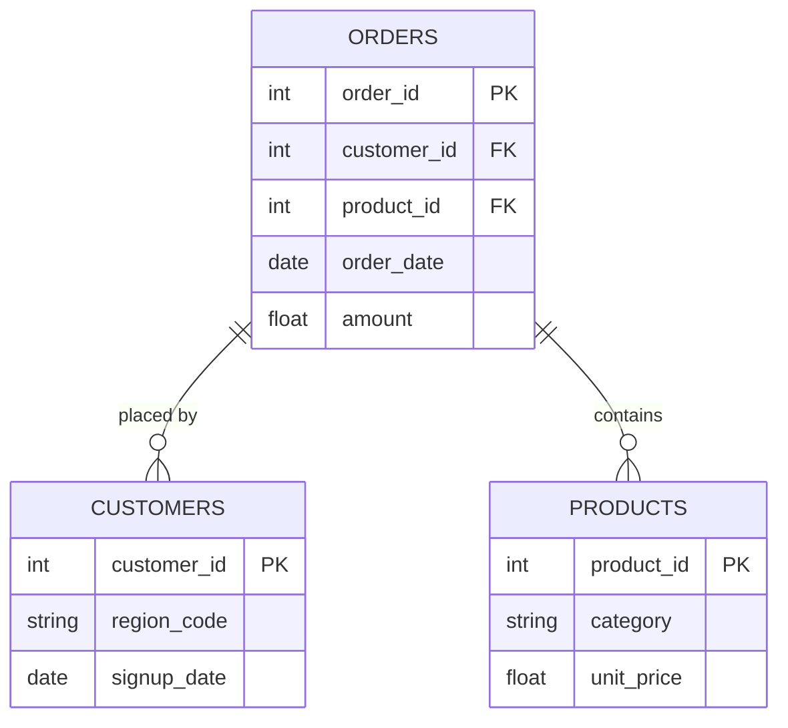

# Furniture Sales Performance Dashboard (Excel)
> *Interactive Excel dashboard analyzing furniture sales performance across different regions in the United States to uncover trends in sales, profit, shipping, and customer segments for better business decision-making.*


---

## Table of Contents

1. [Project Overview](#1-project-overview)
2. [Objectives](#2-objectives)
3. [Project Scope & Tools](#3-project-scope--tools)
4. [Repository Structure](#4-repository-structure)
5. [Data Workflow](#5-data-workflow)
6. [Data Model & Schema](#6-data-model--schema)
7. [Analysis & Metrics](#7-analysis--metrics)
8. [Key Insights](#8-key-insights)
9. [Recommendations](#9-recommendations)
10. [Assumptions & Limitations](#10-assumptions--limitations)
11. [Future Enhancements](#11-future-enhancements)
12. [Deliverables](#12-deliverables)
13. [Author](#13-author)

---

## 1. Project Overview

**Context:** 
This project was developed as part of a hands-on end-to-end Excel dashboard project focused on analyzing furniture sales data across multiple regions in the United States.

**Problem Statement:** 
Businesses often struggle to quickly identify sales trends, profitable regions, top-performing categories, and shipping performance from large sales datasets.

**Approach:**  
Using Microsoft Excel, Power Query, Pivot Tables, Pivot Charts, and slicers, raw sales data was cleaned, transformed, analyzed, and visualized into an interactive dashboard.

**Outcome:**
The final result is a dynamic sales performance dashboard that provides insights into revenue, profit, shipping methods, customer segments, and regional sales performance.

---

## 2. Objectives

- **Primary Objective:** Build an interactive Excel dashboard to analyze furniture sales performance across regions and customer segments.
- **Secondary Objective 1:** Identify trends in sales, profit, and quantity sold over time.
- **Secondary Objective 2:** Analyze shipping methods and delivery performance.
- **Secondary Objective 3:** Visualize geographic and category-level sales performance.

> 💡 *Every analysis and dashboard component in this project was designed to support these objectives.*

---

## 3. Project Scope & Tools

### Scope

-->

| Dimension        | Details |
|-----------------|---------|
| **In Scope**     | Furniture sales data, sales trends, shipping analysis, customer segments, category performance, and regional analysis |
| **Out of Scope** | Predictive modeling, customer demographics, and advanced statistical forecasting |
| **Time Period**  | Historical sales transaction dataset used within the tutorial project |
| **Granularity**  | Transaction-level sales records |

### Tools & Technologies

| Category        | Tool(s) Used |
|----------------|-------------|
| Data Storage    | Excel Workbook / CSV Dataset |
| Data Processing | Microsoft Excel, Power Query |
| Analysis        | Pivot Tables, Pivot Charts |
| Visualization   | Microsoft Excel Dashboard |
| Documentation   | Microsoft Excel / Excel Notes |
| Other           | Slicers, Dynamic Titles |

---

## 4. Repository Structure

```
furniture-sales-performance-dashboard/
│
├── data/
│   ├── raw/          # Original dataset before cleaning
│   └── processed/    # Cleaned and transformed data used for analysis
│
├── dashboard/        # Excel dashboard file (.xlsx)
│
├── visuals/          # Dashboard screenshots for README
│
└── README.md         # You are here (Project documentation)
```

---

## 5. Data Workflow

```
Sales Dataset
      ↓
Data Import into Excel
      ↓
Data Cleaning & Transformation (Power Query)
      ↓
Pivot Table & Pivot Chart Analysis
      ↓
Interactive Dashboard Development
      ↓
Business Insights & Reporting
```

1. **Source:** [Where did the data come from? Format, size, access method.]
2. **Ingestion:** Dataset imported into Microsoft Excel.
3. **Cleaning:** Removed duplicates, standardized formats, and handled inconsistent entries using Power Query.
4. **Transformation:** Created calculated fields, KPIs, and summarized data for dashboard reporting.
5. **Analysis:** Performed trend analysis, category analysis, shipping analysis, and regional comparisons using Pivot Tables and Charts
6. **Output:** Interactive Excel dashboard with filters, KPIs, and visual reports.

---

## 6. Data Model & Schema

# 6. Data Model & Schema

## Dataset: Furniture Sales Data

This dataset contains transactional-level furniture sales records used for analysis and dashboard development.

Each row represents a single sales transaction, including customer, product, shipping, and financial details.

---

## Data Structure

| Field Name     | Data Type | Description | Example Value |
|----------------|----------|-------------|---------------|
| Order ID       | Text     | Unique identifier for each order | CA-2016-152156 |
| Order Date     | Date     | Date the order was placed | 11/08/2016 |
| Ship Date      | Date     | Date the order was shipped | 11/11/2016 |
| Ship Mode      | Text     | Shipping method used | Second Class |
| Customer ID    | Text     | Unique identifier for each customer | CG-12520 |
| Customer Name  | Text     | Name of the customer | Claire Gute |
| Segment        | Text     | Customer segment | Consumer |
| Country        | Text     | Country of purchase | United States |
| City           | Text     | Customer city | Henderson |
| State          | Text     | Customer state | Kentucky |
| Region         | Text     | Geographic region | South |
| Product ID     | Text     | Unique product identifier | FUR-BO-10001798 |
| Category       | Text     | Product category | Furniture |
| Sub-Category   | Text     | Product sub-category | Bookcases |
| Product Name   | Text     | Name of the product | Bush Somerset Collection Bookcase |
| Sales          | Number   | Revenue generated from sale | 261.96 |
| Quantity       | Number   | Number of units purchased | 2 |
| Discount       | Number   | Discount applied to order | 0.00 |
| Profit         | Number   | Profit generated from order | 41.91 |
| Duration       | Text     | Shipping duration | 3 days |
| Month          | Text     | Month of order | Nov |

> **Row count (approx.):** 2122 rows
> **Date range:** 01/06/2014 – 12/30/2017 

---

## 7. ERD - Entity Relationship Diagram
### *(Primarily for SQL Projects - remove this section if not applicable)*

<!--
  An ERD shows how your tables connect to each other visually.
  It is the fastest way for a reviewer to understand the data structure
  of a SQL project without reading every query.

  HOW TO INCLUDE YOUR ERD:
  Option A - Image embed (most common):
    Export your ERD from dbdiagram.io, DBeaver, Lucidchart, or similar.
    Save to /visuals/erd.png and reference it below.

  Option B - dbdiagram.io code block (version-controllable):
    Paste your schema definition code directly in the fenced block below.
    Anyone can paste it into dbdiagram.io to regenerate the visual.

  Option C - Mermaid diagram (renders natively in GitHub):
    Use the mermaid code block syntax below.
    GitHub will render this as a diagram automatically.

  PICK ONE. Don't use all three. Delete the options you don't use.
-->

### Option A - Embedded Image

*[Brief caption: e.g., "Three-table schema - orders, customers, and products joined on shared IDs."]*

---

### Option B - dbdiagram.io Schema Definition
```
Table orders {
  order_id    int     [pk]
  customer_id int     [ref: > customers.customer_id]
  product_id  int     [ref: > products.product_id]
  order_date  date
  amount      float
}

Table customers {
  customer_id int  [pk]
  region_code string
  signup_date date
}

Table products {
  product_id   int    [pk]
  category     string
  unit_price   float
}
```
*Paste this into [dbdiagram.io](https://dbdiagram.io) to view the visual.*

---

### Option C - Mermaid Diagram *(renders on GitHub)*


---

**Table Relationships Summary:**

| Relationship | Join Key | Type |
|-------------|----------|------|
| `orders` → `customers` | `customer_id` | Many-to-One |
| `orders` → `products` | `product_id` | Many-to-One |
| [Add rows as needed] | | |

---

## 8. Analysis & Metrics

<!--
  Explain what you measured and how - before you share what you found.

  WHAT GOOD LOOKS LIKE:
  Metric: "Customer Return Rate"
  Definition: "Number of transactions flagged as returns divided by total
               transactions, calculated at product-category and regional grain."
  Why It Matters: "Return rate - not sales volume - was hypothesised to
                  explain regional revenue gaps. This metric tests that hypothesis."

  WHAT TO AVOID:
  ❌ Defining a metric only in code: SUM(returns) / COUNT(transaction_id)
     That's an implementation. Write the plain-language definition here.
     Both belong in your project - the definition in the README,
     the implementation in the code.
-->

### Analytical Approach

[Describe how you approached the analysis. Were you exploring patterns? Testing a hypothesis? Building and validating a pipeline? Be honest about your method - exploratory work is valid, just call it that.]

### Key Metrics Defined

| Metric | Plain-Language Definition | Why It Matters |
|--------|--------------------------|----------------|
| `[Metric 1]` | [What it measures, in one sentence] | [What decision or question it answers] |
| `[Metric 2]` | [What it measures, in one sentence] | [What decision or question it answers] |
| `[Metric 3]` | [What it measures, in one sentence] | [What decision or question it answers] |

### Methods Used

- [e.g., Descriptive statistics - distribution, central tendency, outlier detection]
- [e.g., Trend analysis across [time period]]
- [e.g., Segmentation / group comparison by [dimension]]
- [e.g., Correlation analysis between [variable A] and [variable B]]
- [e.g., SQL window functions for [specific aggregation]]
- [e.g., Custom aggregation or transformation logic in [tool]]

---

## 9. Key Insights

<!--
  Findings + implications. Not just what happened - what it means.

  WHAT GOOD LOOKS LIKE:
  ✅ "Return rates, not sales volume, explain Region A's underperformance.
      Region A's return rate on home goods was 34% - more than double the
      company average. Revenue was not lost at the point of sale; it was
      lost post-sale through refunds. This points to a fulfilment or
      product quality issue specific to that region, not a demand problem."

  WHAT TO AVOID:
  ❌ "Region A had lower revenue than other regions in Q4."
     (That's an observation. It describes what happened.
      An insight says what it means and where to look next.)

  Aim for 3–6 insights. Quality over quantity.
-->

**Insight 1: [Short descriptive headline]**
[What you found + what it suggests. One short paragraph.]

**Insight 2: [Short descriptive headline]**
[What you found + what it suggests.]

**Insight 3: [Short descriptive headline]**
[What you found + what it suggests.]

**Insight 4 (if applicable): [Short descriptive headline]**
[What you found + what it suggests.]

---

## 10. Recommendations

<!--
  Action-oriented. Addressed to a real audience.
  Tied explicitly to the insight that supports each one.

  WHAT GOOD LOOKS LIKE:
  Priority: High
  Recommendation: "Conduct a fulfilment audit for home goods deliveries
                   in Region A - specifically investigating whether returns
                   correlate with a particular warehouse, carrier, or SKU batch."
  Based On: Insight 1 - return rate anomaly in Region A
  Owner: Operations / Supply Chain team

  WHAT TO AVOID:
  ❌ "Improve the return rate."
     (Not actionable. Doesn't say who, how, or where to start.)
  ❌ "Further analysis is needed."
     (This is a placeholder, not a recommendation.)
-->

| Priority | Recommendation | Based On | Suggested Owner |
|----------|---------------|----------|-----------------|
| High | [Specific, actionable step] | [Insight it comes from] | [Who should act] |
| Medium | [Specific, actionable step] | [Insight it comes from] | [Who should act] |
| Low | [Exploratory or longer-term suggestion] | [Insight it comes from] | [Who should act] |

---

## 11. Assumptions & Limitations

<!--
  WHAT GOOD LOOKS LIKE:
  Assumption: "Transaction records were assumed to be complete for all five regions.
               No validation was performed against source system record counts."
  Limitation: "The analysis cannot distinguish between returns initiated by
               the customer vs. returns initiated by the business (e.g., recalls).
               If business-initiated returns are concentrated in Region A, the
               return rate finding may reflect a policy decision, not a quality issue."

  WHAT TO AVOID:
  ❌ Leaving this section blank or writing "None known."
     Every project has limitations. Documenting them is a sign of
     analytical maturity - not a confession of failure.
-->

### Assumptions
- [What did you treat as true without being able to verify?]
- [What simplifications did you make for scope or feasibility?]
- [What domain rules or definitions did you accept as given?]

### Limitations
- [What gaps exist in the data?]
- [What analysis was out of scope but could affect interpretation?]
- [What would a more rigorous version of this project include?]
- [Are there known biases in the data source or collection method?]

> *The goal here is pre-emptive Q&A. What would a thoughtful skeptic push back on? Document the answer here, before they ask.*

---

## 12. Future Enhancements

<!--
  WHAT GOOD LOOKS LIKE:
  ✅ "Automate the monthly data pull from the POS export folder using
      a scheduled Python script, replacing the current manual process."
  ✅ "Expand the return rate analysis to include carrier-level data,
      which was unavailable in this dataset but exists in the logistics system."

  WHAT TO AVOID:
  ❌ "Add a machine learning model."
     (Vague, and disconnected from the actual findings of this project.)
  ❌ Listing aspirational features that don't follow logically from the work.
-->

- [ ] [Enhancement 1 - specific and traceable to a real gap in this project]
- [ ] [Enhancement 2]
- [ ] [Enhancement 3]
- [ ] [Enhancement 4]

---

## 13. Deliverables

| Deliverable | Description | Location |
|-------------|-------------|----------|
| [Name] | [What it contains] | [`/path/to/file`] |
| [Name] | [What it contains] | [`/path/to/file`] |
| [Name] | [What it contains] | [`/path/to/file`] |

---

## 14. Author

**[Your Name]**
[Your role or title - current or target]

- 🔗 [LinkedIn URL]
- 💼 [Portfolio or GitHub profile URL]
- 📧 [Email - optional]

---

*Last updated: [Month YYYY]*
*If this template helped you, consider starring the repository.*
